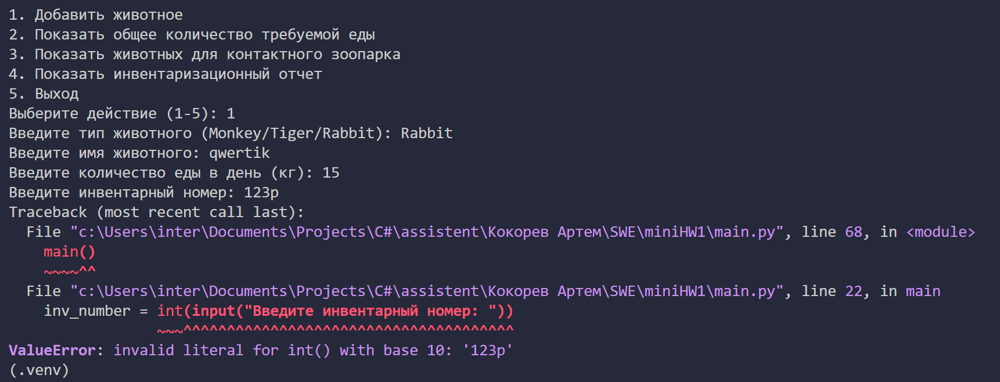

### Ревью

Оценка: `8/10`

Критерии:
- Применение принципов ООП и SOLID: `3/3`
    - Все принципы применены
- Наличие readme с пояснениями: `2/2`
    - Очень подробное readme!
- Применение DI-контейнера: `2/2`
    - Все четенько
- Понятный ввод/вывод информации: `0.5/0.5`
    - Прикольный UI
- Code style: `0.5/0.5`
    - Все четенько
- Unit тесты: `2/2`
    - Присутствуют, тестовое покрытие > 60%

- За что снизил баллы:
    - Exception при вводе инвентарного номера, который содержит цифры `-2 балла`

        

        Нужно обрабатывать абсолютно любой пользовательский ввод. Не должно быть ситуации, при которой пользователь случайно или специально ломает твое приложение